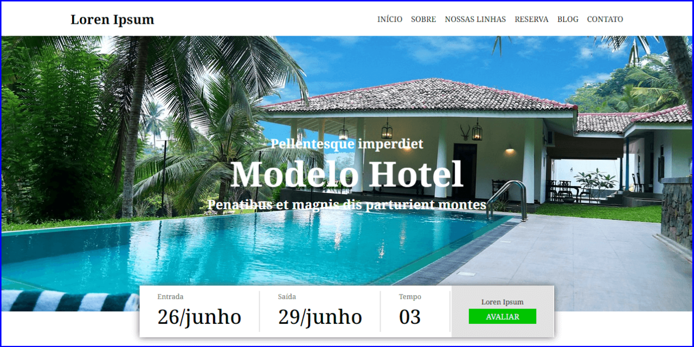
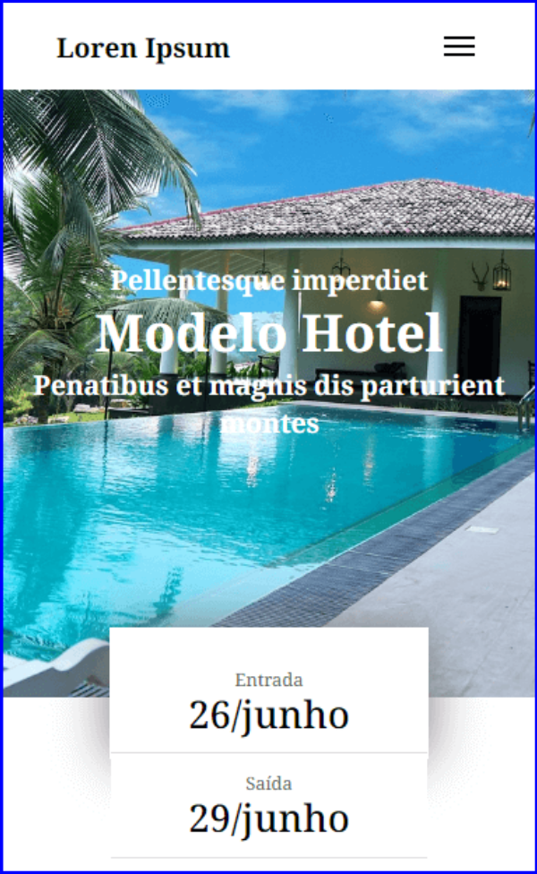

# **Modelo Hotel**

Acesse o Projeto: [Modelo Hotel React](https://reactjs-modelo-hotel.vercel.app/)

## Sobre o projeto

Um site desenvolvido com React JS e TypeScript, utilizando Context API para gerenciamento de estado, empregando Flexbox para layout responsivo. Arquivos e pastas organizados de forma estruturada, fazendo amplo uso de componentes para modularidade e reutilização de código.

Com o objetivo de desenvolver com TypeScript, utilizando Context API para gerenciamento de estado de forma eficiente.

#### About the project

A website developed with React JS and TypeScript, using Context API for state management, employing Flexbox for responsive layout. Files and folders organized in a structured way, making extensive use of components for modularity and code reuse.

With the aim of developing with TypeScript, using Context API to efficiently manage state.

## Mobile Layout

## Tecnologias Utilizadas (Technologies Used)
* HTML5
* CSS3
* Flexbox
* JavaScript
* Typescript
* API JSON Fictícia
* Context API
* React Js Vite

## Instalação (Installation)

##### Instalar Dependências (Install Dependencies)
<pre><code>npm install</code></pre>

##### Executar Aplicação (Run Application)
<pre><code>npm run dev</code></pre>

## Autor (Author)

#### **Katarine Albuquerque**

 &nbsp; 
